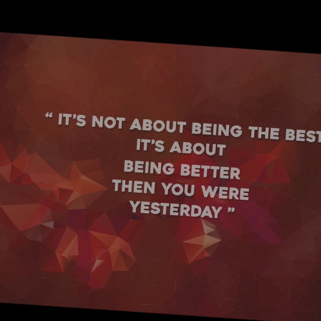
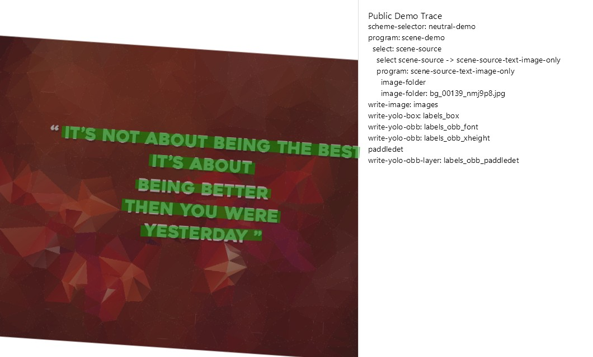
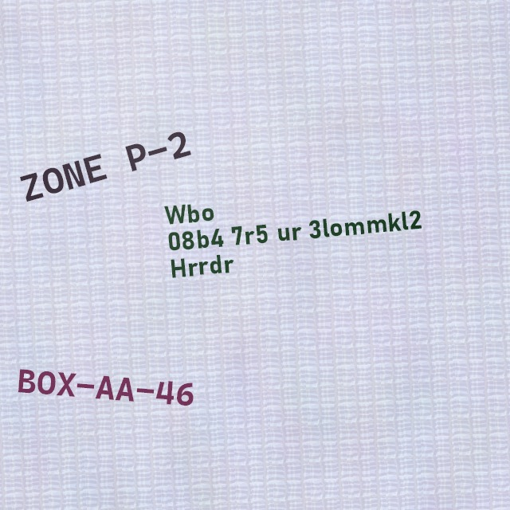
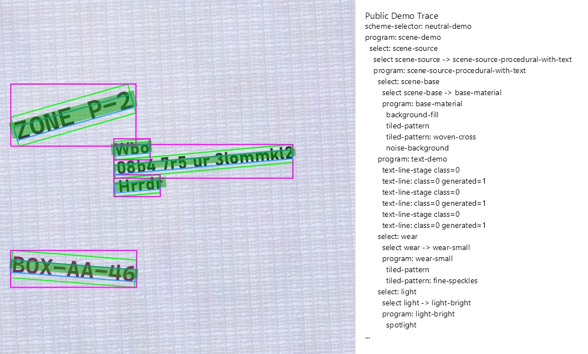
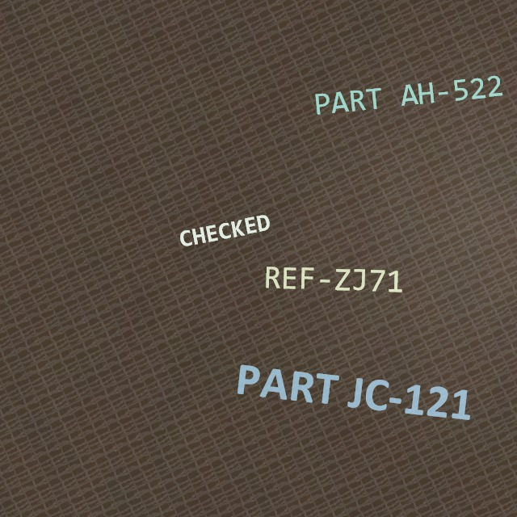
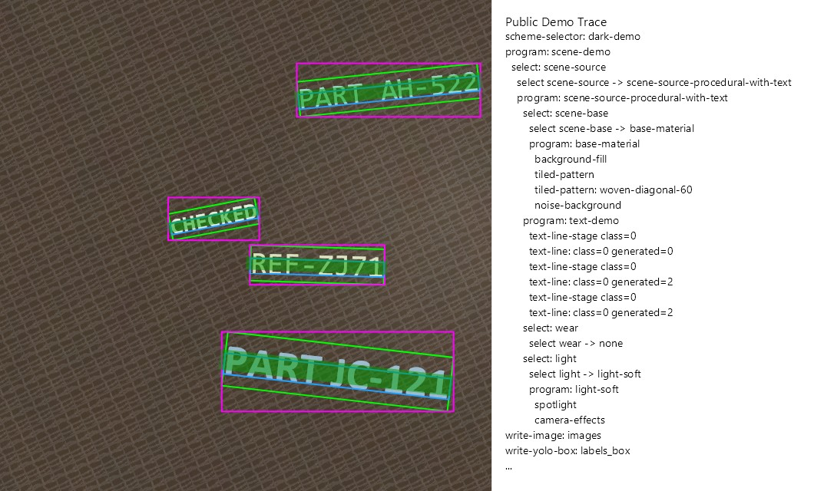

# OBB Text Dataset Generator

**ObbTextGenerator** — .NET-инструмент для генерации синтетических изображений с аннотациями текстовых строк для OCR detection экспериментов.

Текущая публичная точка входа — папка `demo/`. В ней лежат runnable demo config, локальные demo resources и scripts для запуска.

## Что генерируется

- изображения;
- YOLO OBB labels;
- YOLO axis-aligned box labels;
- optional labels из PaddleDet;
- debug previews;
- context dumps для проверки.

## Примеры генерации

| Sample | Image | Debug Preview |
|---|---|---|
| Image<br/>PaddleDet |  |  |
| Light Sheme<br/>Pattern<br/>Text<br/>PaddleDet |  |  |
| Dark  Sheme<br/>Pattern<br/>Text<br/>PaddleDet |  |  |

## Требования

- .NET SDK под target framework решения;
- Windows для текущего bundled OpenCV runtime package;
- optional ONNX Runtime GPU dependencies, если используются GPU backends для PaddleDet.

## Сборка

```powershell
dotnet build .\ObbTextGenerator.slnx -c Release
```

## Запуск demo

Открой `demo/` и следуй инструкции:

- `demo/README_DemoRun.md`

Коротко:

```cmd
cd demo
LoadImageBg.cmd
LoadImageText.cmd
GenWithText.cmd
```

`LoadImageBg.cmd` и `LoadImageText.cmd` подготавливают optional локальные картинки в `LocalArtifacts/`.
`GenWithText.cmd` запускает генератор с `demo/config_text.yaml`.

Результаты пишутся сюда:

```text
LocalArtifacts/GenData
```

Основные папки результата:

- `train/images`, `val/images`;
- `labels_obb_font`;
- `labels_box`;
- `labels_obb_paddledet`;
- `debug_preview`;
- `context_dump`.

## Конфигурация

Публичный demo config:

```text
demo/config_text.yaml
```

Локальные demo YAML resources, например font groups:

```text
demo/Resources
```

Для оценки проекта используй файлы из `demo/`.

## Структура

- `demo/` — public demo config, demo resources и scripts.
- `src/ObbTextGenerator/` — основной generator executable и core pipeline.
- `src/ObbTextGenerator.PaddleDet/` — optional PaddleDet stage module.
- `tools/ObbTextGenerator.Tools.BackgroundDownloader/` — helper tool для скачивания локальных image inputs.
- `LocalArtifacts/` — generated samples, downloaded images, diagnostics и другие локальные outputs.
- `models/` — локальные model files.

`LocalArtifacts/` и `models/` — рабочие локальные папки, не source assets.

## Примечание

Проект публикуется как прикладной research/dataset-generation tool. Public API не зафиксирован, внутренняя архитектура и exporter plans ещё могут меняться.

## Лицензия

MIT. См. `LICENSE`.
